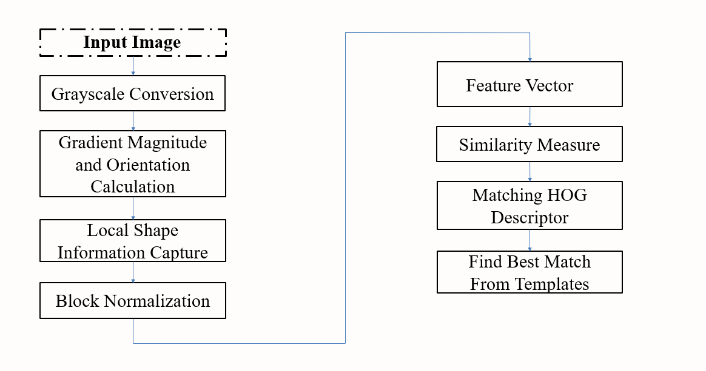

# 🚦 Traffic Sign Recognition System

A computer vision project that detects and classifies traffic signs using **Histogram of Oriented Gradients (HOG)** descriptors. Developed as part of the **CSE 4128 Computer Vision and Image Processing Laboratory** course at *Khulna University of Engineering & Technology (KUET)*.

---

## 📌 Introduction
Automated traffic sign recognition enhances road safety by identifying signs in real-world images. This system uses HOG descriptors to capture local shape information and classify signs based on gradient orientations.

**Key Features**:
- Grayscale conversion and gradient calculation.
- Cell histogram construction and block normalization.
- Euclidean distance-based template matching.

---

## 🛠️ Technologies Used
- **Language**: Python
- **Libraries**: OpenCV, NumPy
- **Algorithm**: HOG (Histogram of Oriented Gradients)

---

## 🔄 Workflow
1. **Input Image** → Grayscale conversion.
2. **Gradient Calculation** (Sobel operators for `grad_x`, `grad_y`).
3. **Cell Histograms** (Binned gradient orientations).
4. **Block Normalization** (Lighting-invariant features).
5. **HOG Descriptor** (Flattened feature vector).
6. **Template Matching** (Euclidean distance comparison).

---

## 📊 Results
- Successfully classified traffic signs using HOG descriptors.
- Achieved accurate matches via Euclidean distance scoring.
  
---

https://github.com/user-attachments/assets/b0d7c267-145f-4e2d-b704-6e967db5fd9f

